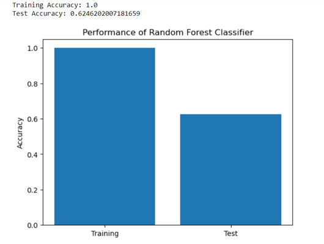
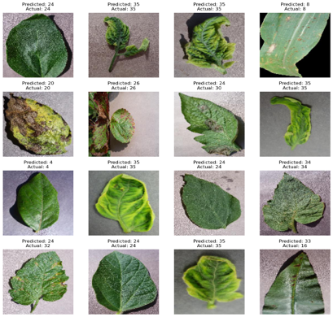
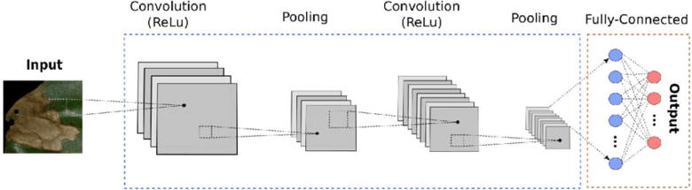
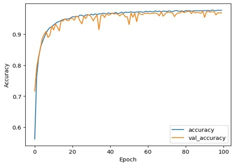
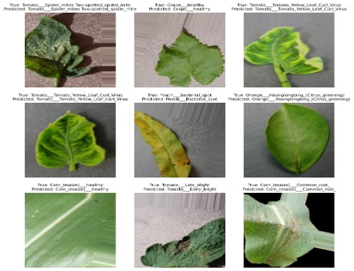
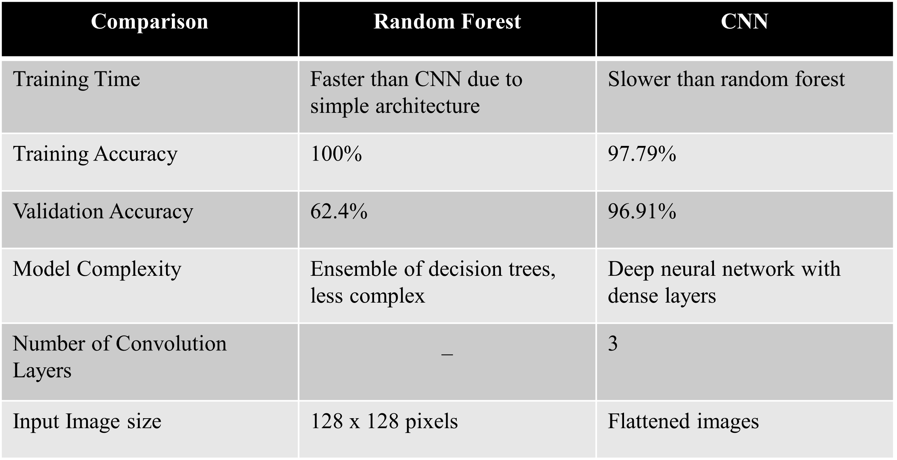

# Plant Disease Detection

Our project aims to automate plant disease detection and classification using CNNs, offering a faster and more accurate alternative to traditional methods that are labor-intensive and time-consuming. 
The motivation stems from the substantial challenges posed by plant diseases to agriculture, such as crop loss and compromised food security. 
By providing farmers with a CNN-based tool for early disease detection, we aim to facilitate timely interventions and improve crop management practices.

**Dataset**

We have worked with the PlantVillage dataset. This dataset contains 38 classes of plants with over 50,000 expertly curated images on healthy and infected leaves of crops plants through the existing online platform PlantVillage. 

**Baseline Model**

  We chose Random Forest as our baseline model for plant disease detection based on several factors:
  
1. Random Forest is ideal for the diverse and complex Plantvillage dataset. Its strength lies in handling high-dimensional data and nonlinear relationships between features, making it effective for both classification and regression tasks.
2. Random Forest's ensemble of decision trees prevents overfitting, making it ideal for datasets like Plant Village, characterized by noise and variability from factors such as image quality differences and plant variations.
3. Random Forest offers feature importance scores, aiding in understanding which image characteristics are most influential in disease classification. This interpretability assists in discerning underlying data patterns.

**Baseline Results**

**Improvised Model**

1. CNNs excel in processing visual data by automatically learning hierarchical representations from raw pixel values, eliminating the need for handcrafted features. This is ideal for our dataset, as CNNs adeptly capture intricate patterns and textures in leaf images, crucial for distinguishing healthy from diseased plants.
2. CNN architectures exploit spatial locality and translational invariance in images, benefiting plant disease detection. They use shared weights and local receptive fields to detect symptoms irrespective of their location, enhancing model robustness and generalization.
3. The hierarchical nature of CNNs enables them to learn increasingly abstract representations of features as information flows through successive layers. This hierarchical feature learning is particularly beneficial for plant disease detection, where diseases may manifest in subtle variations across different plant species and environmental conditions.

**CNN Architecture**

**Improvised Results**

**Comparative Results**

**Conclusion**

1. The CNN model, with its hierarchical feature learning and image-specific architecture, outperforms the Random Forest model in terms of accuracy and generalization for image classification tasks.
2. CNN model appears to be more suitable for image classification tasks due to its ability to learn complex features directly from raw pixel values and achieve higher accuracy.

